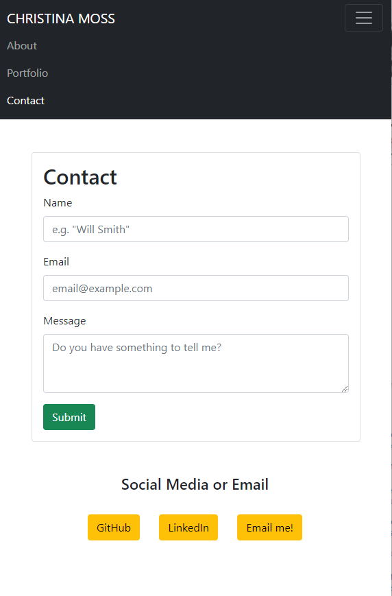

# CHRISTINA MOSS - HOMEWORK 2 - CREATING A RESPONSIVE PORTFOLIO

## DESCRIPTION

I have created a responsive portfolio using Bootstrap v5 css styles and layouts. This incorporates only elements from bootstrap, and little to no css. There is no .css file. The pages are responsive and the layout changes depending on the screen size the user is looking at.

## WHAT WAS DONE?

This code was made from scratch. I created 3 pages: an About Me, a Portfolio, and a Contact Form. Each page has a working navigation bar and content. All of this was created using Bootstrap. 

## DEPLOYED!

This project was successfully deployed. Need proof? Click the links below to give it a try. (You can also navigate the pages using links in the navbar.)

[About Me](https://cmoss703.github.io/hw2-responsive-portfolio/index.html)

[Portfolio](https://cmoss703.github.io/hw2-responsive-portfolio/portfolio.html)

[Contact](https://cmoss703.github.io/hw2-responsive-portfolio/contact.html)

[Github repo](https://github.com/cmoss703/hw2-responsive-portfolio)

## PROOF

I promise I made the pages, here look at my screenshots:

About Me:

