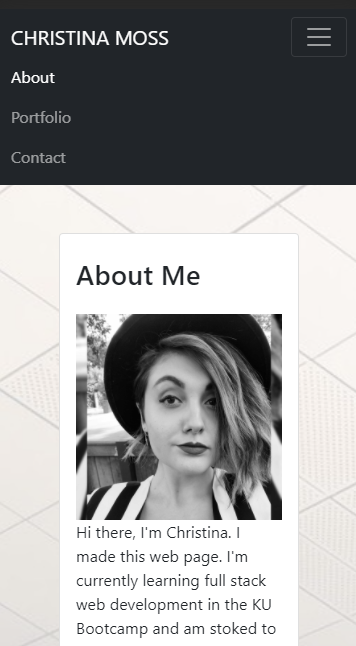
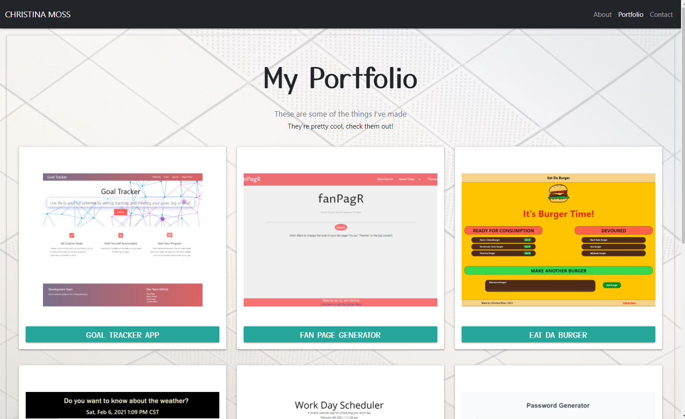
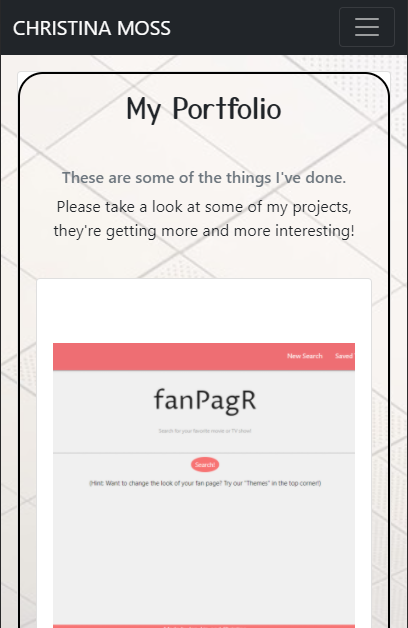
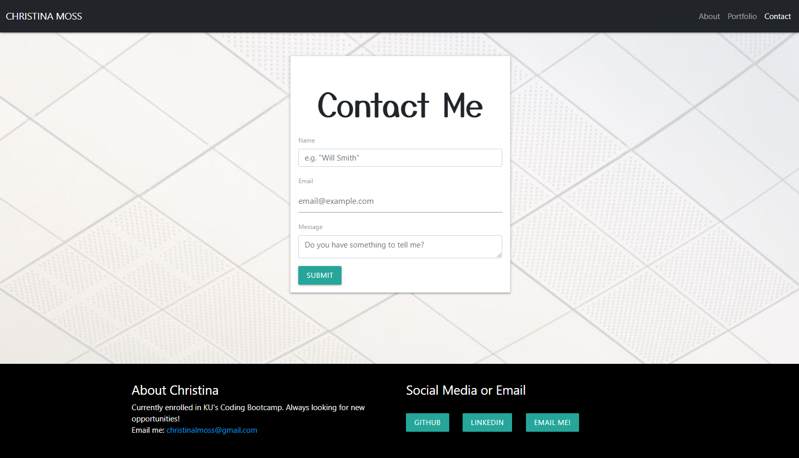

# CHRISTINA MOSS - PORTFOLIO

## BRAND STATEMENT

Hello, I'm Christina. I'm a Full Stack web developer with a background in fire protection engineering and building life safety codes. Recently earned a certificate in full stack web development from the University of Kansas Coding Bootcamp, with newly developed skills in JavaScript, CSS, React.js, and responsive web design. With an engineering consulting and design background, I am proficient in developing creative solutions to complex problems, have experience meeting short deadlines with efficiency, and collaborating with team members to maintain the overall vision of the project at hand. With each project, my aim is to develop a user friendly and efficient, responsive design that makes the user’s life easier in any way possible.

## HEY LOOK MA, I'M CODING

This portfolio shows off the projects I've completed so far. There's also an About Me page and a Contact Info link at the top. Feel free to check out the links to my projects in the page, they're pretty impressive. As I continue to generate more projects, they'll be added here!

## LINKS

[My Portfolio](https://cmoss703.github.io/portfolio/portfolio.html)

[Github Profile](https://github.com/cmoss703)

[LinkedIn](https://www.linkedin.com/in/christina-moss-eit-86614092/)

[View or Download my Resume](https://drive.google.com/file/d/1xeC8TDVQev_SFY1KB1f2LtECM-yVNPpM/view?usp=sharing)

## THIS REPOSITORY

This project was successfully deployed. Need proof? Click the links below to give it a try. (You can also navigate the pages using links in the navbar.)

[About Me](https://cmoss703.github.io/portfolio/index.html)

[Portfolio](https://cmoss703.github.io/portfolio/portfolio.html)

[Contact](https://cmoss703.github.io/portfolio/contact.html)

[Github repo](https://github.com/cmoss703/portfolio)

## PROOF

I promise I made the pages, here look at my screenshots:

About Me:

About Me Alt Layout:

Portfolio:

Portfolio Alt Layout:

Contact:

Contact Alt Layout:

